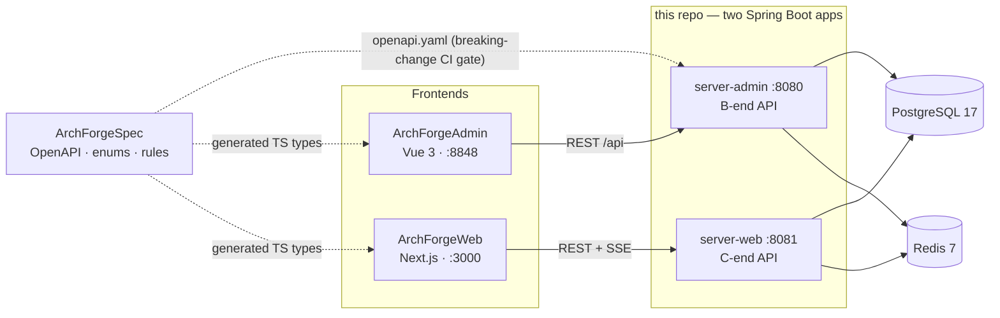
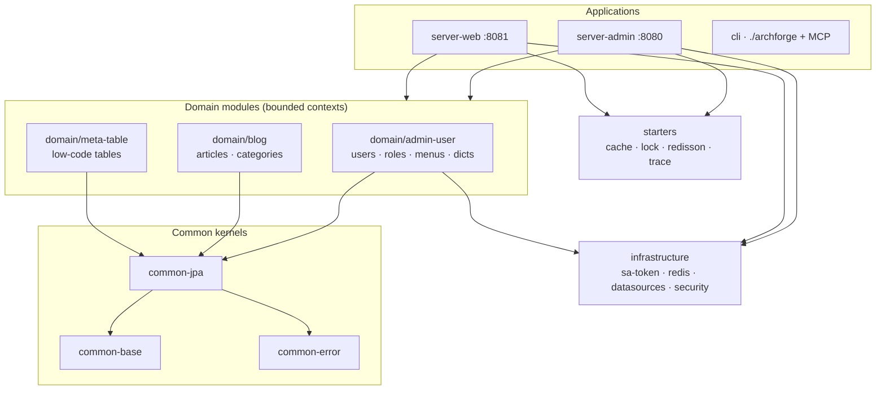

<div align="center">
  <h1>ArchForge</h1>
  <p><strong>Backend for the ArchForge platform — Spring Boot 4 + JDK 25 + sa-token</strong></p>
  <p>
    <a href="https://archforge.lesofn.com">Documentation</a> ·
    <a href="./README.zh-CN.md">中文</a>
  </p>
  <p>
    
    
    
    
    
    
  </p>
</div>

---

## What is this repo?

This repository is the **backend** of the five-repo ArchForge project. It builds **two Spring Boot applications from one codebase**: the admin (`:8080`) API consumed by [ArchForgeAdmin](https://github.com/sofn/ArchForgeAdmin), and the C-end (`:8081`) API consumed by [ArchForgeWeb](https://github.com/sofn/ArchForgeWeb).

## ✨ Features

- **Two apps, one codebase** — `server-admin` (B-end, `{code,message,data}` envelope) and `server-web` (C-end, RFC 9457 ProblemDetail), each with its own sa-token realm
- **Contract-first** — [ArchForgeSpec](https://github.com/sofn/ArchForgeSpec) owns OpenAPI 3.1 + enums; CI diffs the live spec against it and blocks breaking changes
- **Java 25 + virtual threads**, optional GraalVM native image (~100 ms start)
- **DDD modules** guarded by Spring Modulith verification and fail-fast ArchUnit rules
- **Meta-table engine** — low-code tables with schema evolution, code generation, and REFERENCE fields
- **ChatAI module** — bring your own LLM (OpenAI/Anthropic compatible), streamed over SSE
- **Permission matrix, data scope, db-scheduler clustering, operation/login logs** out of the box
- **Developer CLI** — `./archforge` bootstraps env secrets, docker infra, DB backups, AI skills, MCP

## 🏛 Architecture

System context — how the five sibling repositories fit together:



Backend module layering — every Java module is prefixed with `archforge-`:



Layering is enforced by tests: controllers never touch repositories, domain modules never depend on server packages, and every rule fails if it accidentally matches zero classes. See [`ArchitectureTest`](archforge-server-admin/src/test/java/com/lesofn/archforge/server/admin/architecture/ArchitectureTest.java).

The full story lives in the [architecture guide](https://archforge.lesofn.com/guide/architecture).

## 🚀 Quick start

Prerequisites: **Java 25**, Docker.

```bash
git clone git@github.com:sofn/ArchForge.git && cd ArchForge
./archforge init --write            # idempotent .env secrets
./archforge infra up                # postgres + redis via docker compose
set -a; source .env; set +a         # export DB_PASSWORD, sa-token secrets
FILE_STORAGE_TYPE=local ./gradlew :archforge-server-admin:bootRun
```

Default admin login is `admin / admin123` (captcha is on in `dev`). C-end API:

```bash
./gradlew :archforge-server-web:bootRun
```

## 🔐 Auth and security

- **sa-token 1.45.0**, not Spring Security JWT filters.
- Admin: `StpAdminUtil` + class-level `@SaCheckLogin` + write `@SaCheckPermission("resource:action")`.
- Web: `StpWebUtil` + `WebAuthInterceptor`, refresh-token flow with single-use rotation.
- Login rate limit: 5 requests / minute / IP (`@RateLimit`).
- XSS filter sanitizes query/header values and **skips multipart** uploads.
- Production must inject `DB_PASSWORD`, `ARCH_FORGE_RSA_PRIVATE_KEY`, and storage keys; missing RSA in `prod` fails fast.

## 📦 Modules

| Module | Purpose |
|--------|---------|
| `archforge-common/archforge-common-{base,error,jpa}` | shared kernels: utils, `ErrorCode` framework, JPA conventions |
| `archforge-domain/archforge-admin-user` | users, roles, menus, depts, dicts (DDD) |
| `archforge-domain/archforge-blog` | articles, categories |
| `archforge-domain/archforge-meta-table` | low-code table engine |
| `archforge-infrastructure` | sa-token config, Redis, dynamic datasources, security filters |
| `archforge-server-admin` | B-end application (`:8080`) |
| `archforge-server-web` | C-end application (`:8081`) |
| `archforge-starters/*` | cache / lock / redisson / trace starters |
| `archforge-cli` | `./archforge` developer CLI + MCP server |
| `archforge-example/archforge-example-task` | demo task module (still linked from `/task`) |
| `archforge-dependencies` | version platform (BOM) |

Non-Gradle dirs stay unprefixed: `docker/`, `config/`, `scripts/`, `skills/`.

## 🧪 Build, test, quality gates

```bash
./gradlew build                                    # spotless + compile + all tests
./gradlew test -Ptags=P0,contract                  # only tagged tests
./gradlew build -PexcludeTags=slow                 # skip container-backed integration tests
./gradlew jacocoAggregateReport                    # merged coverage report
```

What CI enforces on every PR ([ci.yml](.github/workflows/ci.yml)):

| Gate | Mechanism |
|------|-----------|
| Diff coverage ≥ 60% | `diff-cover` on the aggregated JaCoCo report |
| No breaking API changes | `oasdiff` live spec vs `ArchForgeSpec/api/openapi.yaml` |
| Error codes documented | `scripts/check-error-codes.py` vs `specs/error-codes.md` |
| Frontend SDK in sync | `git diff --exit-code` after regenerating `schema.d.ts` (in Web/Admin repos) |
| Architecture rules | ArchUnit with `failOnEmptyShould=true` |

## 🛠 Developer CLI

```bash
./archforge --help
./archforge init --write          # idempotent .env secrets
./archforge infra up              # postgres + redis via docker/docker-compose.infra.yml
./archforge db backup
./archforge skills install --tool claude
./archforge --mcp                 # Phase-1 MCP stdio server
```

If the fat jar is missing, `./archforge` builds `:archforge-cli:shadowJar` first.

Windows: run `archforge.bat` instead — same commands (`archforge --help`, `archforge init --write`, …). It builds the jar via `gradlew.bat` on first run and needs `java` on `PATH`.

## 📚 Tech stack

| Layer | Choice |
|-------|--------|
| Runtime | Java 25 (preview), Spring Boot **4.1.0**, Gradle **9.5.1** |
| Auth | sa-token **1.45.0** (`StpAdminUtil` / `StpWebUtil`) |
| Data | PostgreSQL 17, Flyway **12.4.0**, dynamic-datasource, Redis 7 |
| Observability | Micrometer + OpenTelemetry **1.62.0** |
| Storage | Local dir or AWS S3 SDK 2.46.x |
| Style | Spotless + Eclipse formatter, JSpecify `@NullMarked` |

Canonical conventions: `skills/archforge-project-standard/standard.md`.

## License

[Apache-2.0](./LICENSE)
