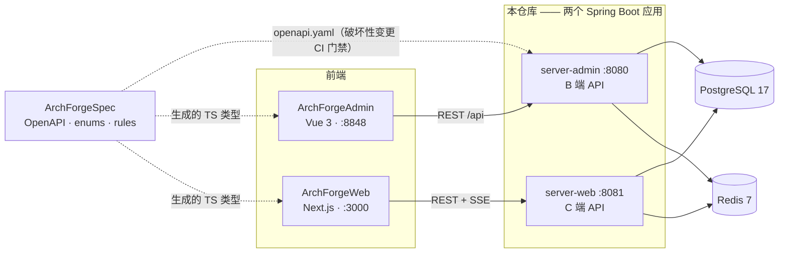
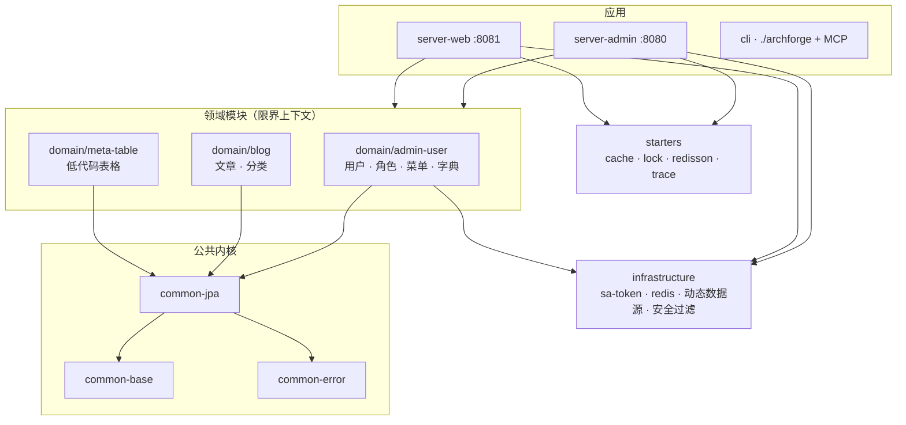

<div align="center">
  <h1>ArchForge</h1>
  <p><strong>ArchForge 后端 — Spring Boot 4 + JDK 25 + sa-token</strong></p>
  <p>
    <a href="https://archforge.lesofn.com">在线文档</a> ·
    <a href="./README.md">English</a>
  </p>
  <p>
    
    
    
    
    
  </p>
</div>

---

## 这是哪个仓库？

本仓库是五仓 ArchForge 的 **后端**：一套代码构建 **两个 Spring Boot 应用** —— 管理端 API（`:8080`，供 [ArchForgeAdmin](https://github.com/sofn/ArchForgeAdmin) 使用）与 C 端 API（`:8081`，供 [ArchForgeWeb](https://github.com/sofn/ArchForgeWeb) 使用）。

## ✨ 特性

- **一套代码、两个应用** — `server-admin`（B 端，`{code,message,data}` envelope）与 `server-web`（C 端，RFC 9457 ProblemDetail），各自独立的 sa-token 认证域
- **契约先行** — [ArchForgeSpec](https://github.com/sofn/ArchForgeSpec) 统一持有 OpenAPI 3.1 与枚举；CI 将 live spec 与契约做 diff，破坏性变更直接拦截
- **Java 25 + 虚拟线程**，可选 GraalVM Native Image（约 100ms 启动）
- **DDD 模块化** — Spring Modulith 边界校验 + ArchUnit 规则（空匹配即失败）
- **元表格引擎** — 低代码建表、schema 演进、代码生成、REFERENCE 关联字段
- **ChatAI 模块** — 自带密钥接入 LLM（OpenAI / Anthropic 兼容），SSE 流式输出
- **权限矩阵、数据权限、db-scheduler 集群调度、操作/登录日志** 开箱即用
- **开发 CLI** — `./archforge` 一键初始化密钥、拉起 docker 基础设施、备份数据库、安装 AI 技能、MCP

## 🏛 架构

系统上下文 —— 五个并列仓库如何协作：



后端模块分层 —— 所有 Java 模块带 `archforge-` 前缀：



分层由测试强制保证：Controller 不触碰 Repository、领域模块不依赖 server 包，且任何规则意外匹配到 0 个类时直接失败。见 [`ArchitectureTest`](archforge-server-admin/src/test/java/com/lesofn/archforge/server/admin/architecture/ArchitectureTest.java)。

完整说明见[架构指南](https://archforge.lesofn.com/zh/guide/architecture)。

## 🚀 快速开始

需要 **Java 25** 和 Docker。

```bash
git clone git@github.com:sofn/ArchForge.git && cd ArchForge
./archforge init --write            # 幂等写入 .env 密钥
./archforge infra up                # docker compose 拉起 postgres + redis
set -a; source .env; set +a         # 导出 DB_PASSWORD、sa-token 密钥
FILE_STORAGE_TYPE=local ./gradlew :archforge-server-admin:bootRun
```

默认管理员 `admin / admin123`（`dev` 开验证码）。C 端 API：

```bash
./gradlew :archforge-server-web:bootRun
```

## 🔐 认证与安全

- **sa-token 1.45.0**，不是 Spring Security JWT Filter。
- 管理端：`StpAdminUtil` + 类级 `@SaCheckLogin` + 写操作 `@SaCheckPermission("resource:action")`。
- C 端：`StpWebUtil` + `WebAuthInterceptor`，refresh-token 单次轮换。
- 登录限流：5 次/分钟/IP（`@RateLimit`）。
- XSS 过滤 query/header，**跳过 multipart**。C 端上传走共享 `FileUploadValidator`，拒绝 SVG/HTML。
- 生产必须注入 `DB_PASSWORD`、`ARCH_FORGE_RSA_PRIVATE_KEY` 与存储密钥；`prod` 缺 RSA 会启动失败。

管理端成功响应 `{code,message,data}`。C 端错误为 RFC 9457 `ProblemDetail`。

附加能力：

- 仪表盘 `GET /admin/dashboard/metrics|trends|recent-activities|todo`
- 权限矩阵 `/admin/permission-matrix/**`
- ChatAI `/admin/chat/**`，密钥由环境变量 `LLM_PROVIDER` / `LLM_BASE_URL` / `LLM_API_KEY` / `LLM_MODEL` 提供（OpenAI 或 Anthropic 兼容），仓库不内置密钥

## 📦 模块

| 模块 | 职责 |
|------|------|
| `archforge-common/archforge-common-{base,error,jpa}` | 公共内核：工具、`ErrorCode` 框架、JPA 约定 |
| `archforge-domain/archforge-admin-user` | 用户、角色、菜单、部门、字典（DDD） |
| `archforge-domain/archforge-blog` | 文章、分类 |
| `archforge-domain/archforge-meta-table` | 低代码表格引擎 |
| `archforge-infrastructure` | sa-token 配置、Redis、动态数据源、安全过滤器 |
| `archforge-server-admin` | B 端应用（`:8080`） |
| `archforge-server-web` | C 端应用（`:8081`） |
| `archforge-starters/*` | cache / lock / redisson / trace 启动器 |
| `archforge-cli` | `./archforge` 开发者 CLI + MCP server |
| `archforge-example/archforge-example-task` | 示例任务模块（仍被 `/task` 使用） |
| `archforge-dependencies` | 版本平台（BOM） |

非 Gradle 目录不加前缀：`docker/`、`config/`、`scripts/`、`skills/`。

## 🧪 构建、测试与质量门禁

```bash
./gradlew build                                    # spotless + 编译 + 全部测试
./gradlew test -Ptags=P0,contract                  # 只跑指定 tag
./gradlew build -PexcludeTags=slow                 # 跳过容器集成测试
./gradlew jacocoAggregateReport                    # 聚合覆盖率报告
```

每个 PR 都要过的 CI 门禁（[ci.yml](.github/workflows/ci.yml)）：

| 门禁 | 机制 |
|------|------|
| 变更行覆盖率 ≥ 60% | 聚合 JaCoCo 报告 + `diff-cover` |
| API 无破坏性变更 | `oasdiff` 对比 live spec 与 `ArchForgeSpec/api/openapi.yaml` |
| 错误码已登记 | `scripts/check-error-codes.py` 对比 `specs/error-codes.md` |
| 前端 SDK 同步 | 重新生成 `schema.d.ts` 后 `git diff --exit-code`（Web/Admin 仓库） |
| 架构规则 | ArchUnit，`failOnEmptyShould=true` |

约定见 `skills/archforge-project-standard/standard.md`。每个 `src/main/java` 包必须有 `@NullMarked` 的 `package-info.java`。

## 🛠 开发者 CLI

```bash
./archforge --help
./archforge init --write          # 幂等写入 .env 密钥
./archforge infra up              # postgres + redis
./archforge db backup
./archforge skills install --tool claude
./archforge --mcp                 # Phase-1 MCP stdio
```

缺少 fat jar 时，`./archforge` 会先构建 `:archforge-cli:shadowJar`。

Windows：使用 `archforge.bat`，命令相同（`archforge --help`、`archforge init --write`……）。首次运行会通过 `gradlew.bat` 构建 jar，需要 `java` 在 `PATH` 中。

## 📚 技术栈

| 层 | 选型 |
|----|------|
| 运行时 | Java 25（preview）、Spring Boot **4.1.0**、Gradle **9.5.1** |
| 认证 | sa-token **1.45.0**（`StpAdminUtil` / `StpWebUtil`） |
| 数据 | PostgreSQL 17、Flyway **12.4.0**、dynamic-datasource、Redis 7 |
| 可观测 | Micrometer + OpenTelemetry **1.62.0** |
| 存储 | 本地目录或 AWS S3 SDK 2.46.x |
| 风格 | Spotless + Eclipse formatter、JSpecify `@NullMarked` |

## License

[Apache-2.0](./LICENSE)
